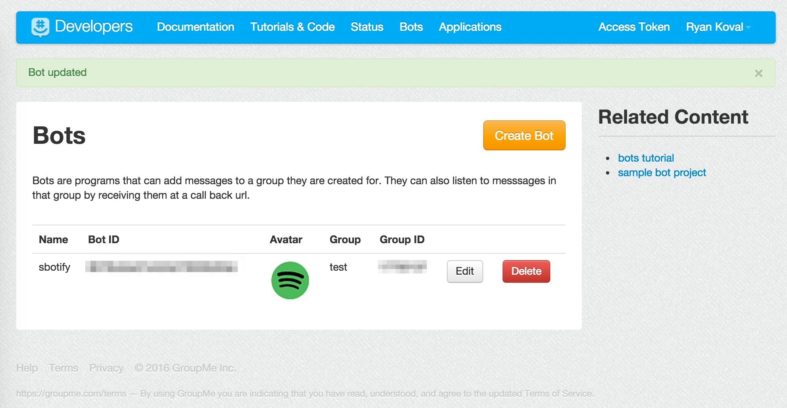
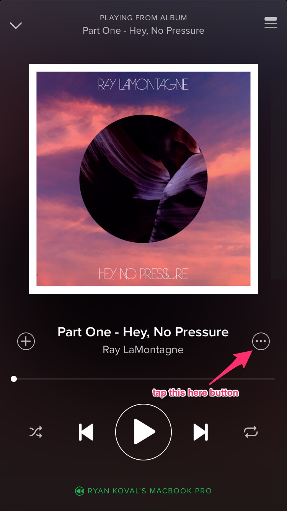
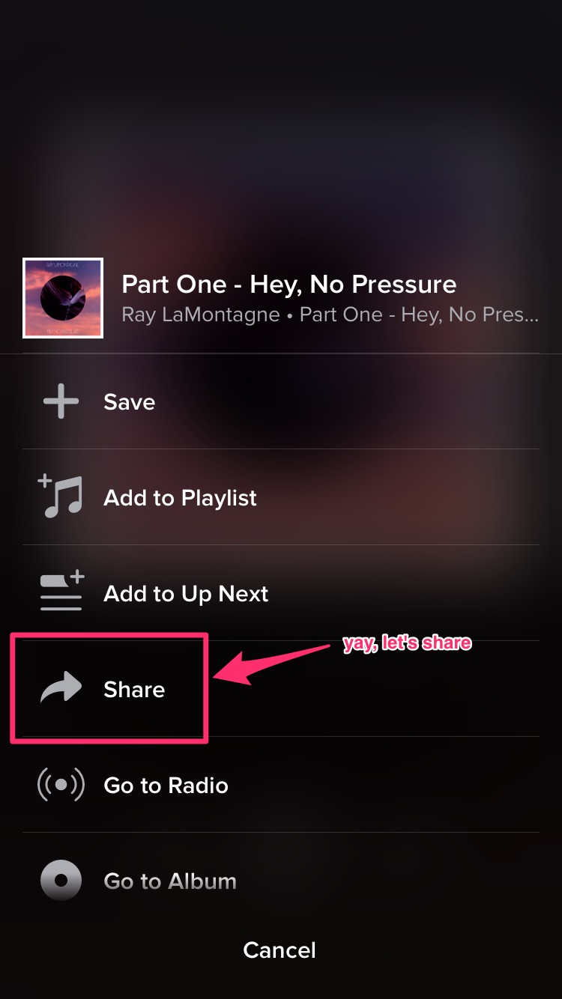
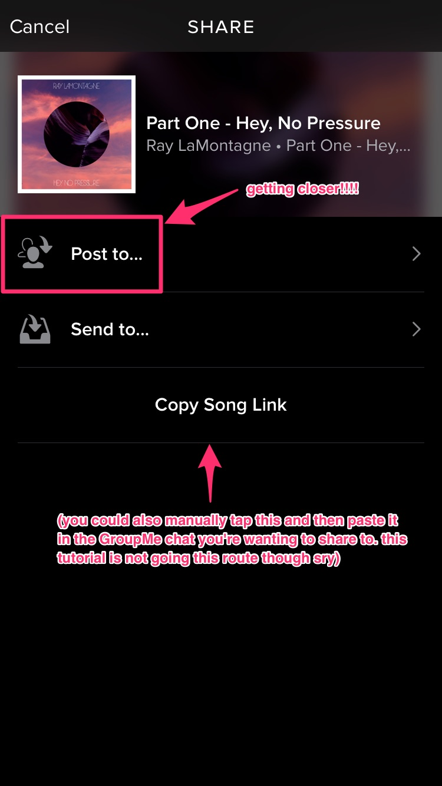
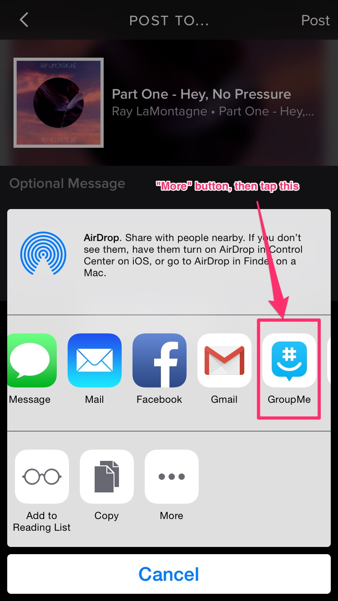
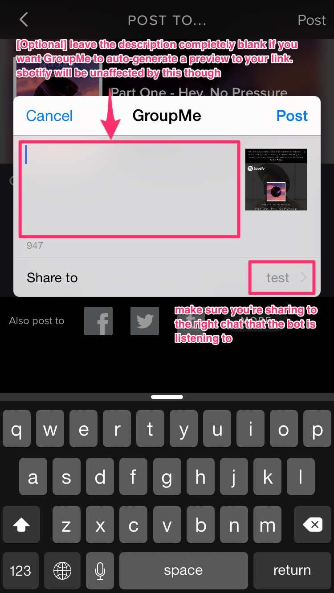
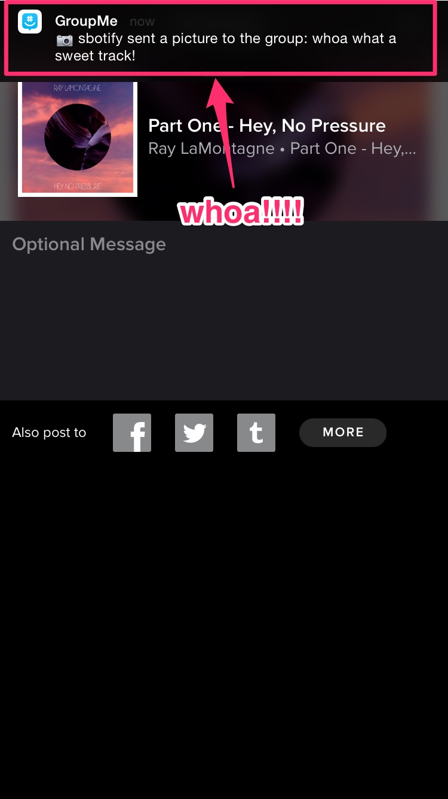
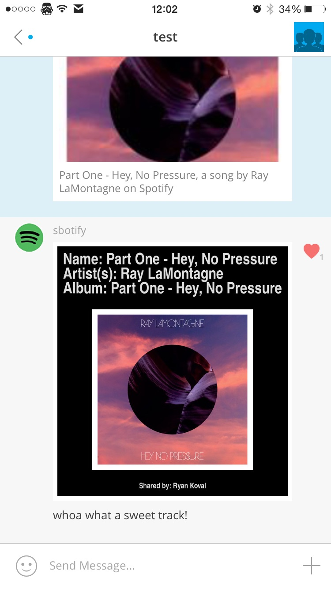
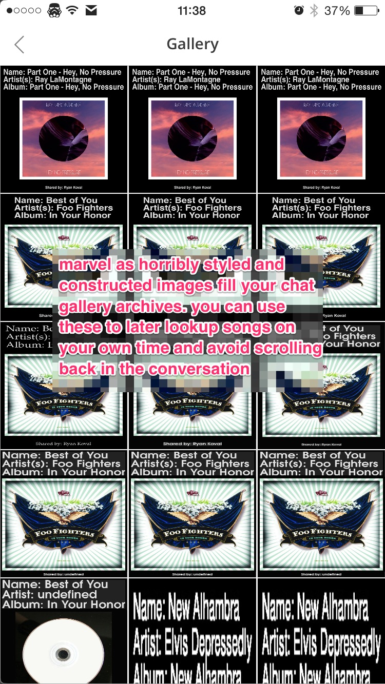

# sbotify
A pointless GroupMe bot that integrates with Spotify to create summary gallery images from Spotify share links. 

Written using [nodejs](https://nodejs.org/en/) with ES2015 & ES2016 features and transpiled via [Babel](https://babeljs.io/).

## Motivation
I made this tool because a GroupMe music sharing group that I'm in relies on screenshots of your Spotify app while you're listening to music. Because GroupMe will archive all images sent in its gallery, this provides an easy way to look at all Spotify shares that have been sent to the app. 

Unfortunately, this makes it very obnoxious to actually *listen* to the music because you now have to manually search for said artist/track in Spotify. Ugh!!! With this bot, we can port over to just utilizing Spotify share links (e.g., [https://open.spotify.com/track/64aCMaBE1o5aExuqAtVht6](https://open.spotify.com/track/64aCMaBE1o5aExuqAtVht6)). The bot will then parse these links, create a summary image with artist info using the Spotify API, and then send a generated image back to the chat so that the gallery archives are still retained. It gives the best of both worlds!

I also wanted to dork around with ES2015 & ES2016 features in node since I hadn't really done that before, so this was an opportunity to do so.

## Installation
1. Run these commands:
   ```sh
   cd some/installation/directory
   git clone git@github.com:rkoval/sbotify.git
   cd sbotify
   npm install
   ```
   
   Add the `--only=prod` option to `npm install` if you're installing to production. This will prevent unnecessary dev dependencies from being installed.

1. Modify [the config](config/default.json) and populate your Spotify and GroupMe API tokens. Also make sure to populate the GroupMe `groupId` so that your bot knows where to listen from and send to.

1. Install [ImageMagick](https://github.com/ImageMagick/ImageMagick). There are installation readmes in .txt form at the root of the project.

1. Install [Ghostscript](http://www.ghostscript.com/), which is necessary for ImageMagick fonts

   ```
   brew install ghostscript
   ```

1. Make sure that your bot is configured for GroupMe:


   See [their documentation](https://dev.groupme.com/tutorials/bots) for more details on how to actually create a bot.


## Running the bot
For **local development**, use the runtime transpiler (which is discouraged in production by Babel):

```
npm run dev
```
For **production**, transpile all JS resources and then run the generated assets:

```
npm postinstall && npm start
```

(See [package.json](package.json) for more details on what these tasks actually do.)

If the bot has successfully connected to GroupMe, you will see logging in the console exclaiming so. It will continue to listen for messages to parse until

## User Tutorial
Check out this crappy series of images to learn how to actually utilize the bot and verify that it's working properly:

### Step 1


### Step 2


### Step 3


### Step 4


### Step 5


### Step 6


### Step 7


### Step 8

